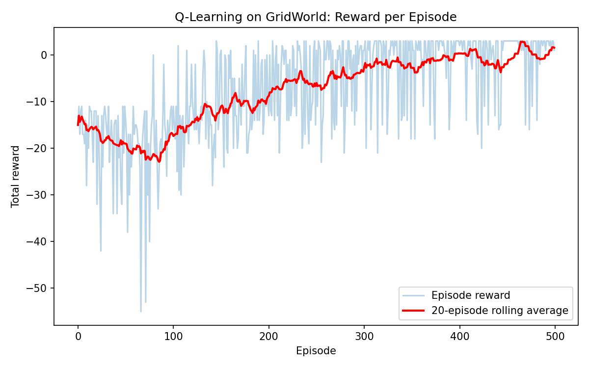

# Q-Learning on a Grid World

A from-scratch implementation of tabular **Q-learning**, a foundational
reinforcement learning algorithm, applied to a simple grid-navigation
task. The agent learns, purely through trial and error, to find the
shortest safe path from a start cell to a goal cell while avoiding pits.

I built this to get hands-on with reinforcement learning fundamentals —
state-action value functions, the exploration/exploitation trade-off,
and the Bellman update — as a first step toward more advanced RL and
quantum machine learning topics.

## How it works

- **Environment** (`gridworld.py`): a 5×5 grid. The agent starts at the
  top-left corner `(0,0)` and must reach the goal at the bottom-right
  corner `(4,4)`. Three cells are "pits" that end the episode with a
  large penalty. Every other step costs a small penalty, so the agent
  is incentivized to find the *shortest* safe route, not just any route.

- **Agent** (`q_learning_agent.py`): maintains a table `Q(state, action)`
  estimating the expected future reward of each action in each state.
  It updates this table after every step using the Bellman equation:

  ```
  Q(s, a) ← Q(s, a) + α [ r + γ · max_a' Q(s', a') − Q(s, a) ]
  ```

  Actions are chosen with an **epsilon-greedy** policy: the agent starts
  by exploring randomly (ε = 1.0), and gradually shifts toward
  exploiting its learned Q-values as ε decays toward a small floor.

- **Training loop** (`train.py`): runs 500 episodes, prints the final
  learned policy as a grid of arrows, and plots total reward per episode
  to show the agent's performance improving over time.

## Running it

```bash
pip install numpy matplotlib
python train.py
```

## Results

Average total reward over the first 20 episodes vs. the last 20:

| | Avg. reward |
|---|---|
| First 20 episodes (mostly random exploration) | ≈ -15 |
| Last 20 episodes (mostly learned policy) | ≈ +1.5 |



The learned policy correctly routes around every pit to reach the goal
by the shortest path:

```
→  →  ↓  ↓  ↓
↓  X  ↓  →  ↓
→  →  ↓  X  ↓
←  X  →  →  ↓
→  →  →  ↑  G
```
(`X` = pit, `G` = goal; arrows show the greedy action learned for each cell)

## What I'd extend next

- Compare Q-learning against SARSA (on-policy vs. off-policy learning)
- Move from a tabular Q-table to a neural network (Deep Q-Network) for
  larger or continuous state spaces
- Explore how a variational quantum circuit could replace the Q-table
  as a function approximator (quantum reinforcement learning)
